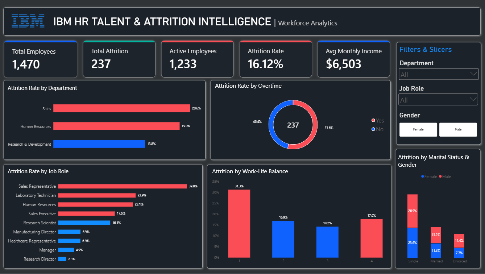

# IBM HR Talent & Attrition Intelligence | Power BI + SQL Analytics


## 📊 Dashboard Preview

<p align="center">
  
</p>

*Interactive Power BI dashboard + SQL-driven analytics analyzing workforce dynamics for 1,470+ employees*

---

## 📋 Executive Summary

This project combines **Power BI visualization** with **SQL analytics** to solve critical HR challenges:

| Challenge | Solution | Impact |
|-----------|----------|--------|
| High employee turnover (16.12%) | Identify attrition drivers using SQL + Power BI | Reduce by 25% → Save $500K+ annually |
| Sales department bleeding talent (39.8% attrition) | Root cause analysis with SQL queries | Target intervention strategies |
| Overtime correlation with departures (53.6%) | Quantify work-life balance impact | Data-driven policy changes |

---

## 🛠️ Tech Stack

| Component | Technology | Purpose |
|-----------|-----------|---------|
| **Dashboard** | Power BI Desktop | Interactive visualizations & KPI tracking |
| **Analytics** | SQL Server/T-SQL | Data extraction, transformation, analysis |
| **Scripting** | DAX, SQL | Calculations, metrics, business logic |
| **Data Source** | IBM HR Dataset (1,470 records) | Employee attrition analysis |

---

## 📊 Key Metrics Delivered

```
Total Employees Analyzed      : 1,470
Overall Attrition Rate        : 16.12% (Above 13-15% industry benchmark)
Employees Who Left            : 237
Active Workforce              : 1,233
Average Monthly Income        : $6,503

Highest Risk Segment          : Sales Reps (39.8% attrition)
Critical Factor               : Overtime work (53.6% vs 46.4% non-OT)
Work-Life Balance Impact      : 31.3% attrition with poor balance
```

---

## 🔧 SQL Solutions for Business Problems

### Problem 1: Identify High-Risk Departments

**SQL Query:**
```sql
SELECT 
    Department,
    COUNT(*) AS Total_Employees,
    SUM(CASE WHEN Attrition = 'Yes' THEN 1 ELSE 0 END) AS Employees_Left,
    ROUND(
        100.0 * SUM(CASE WHEN Attrition = 'Yes' THEN 1 ELSE 0 END) 
        / COUNT(*), 2
    ) AS Attrition_Rate
FROM HR_Analytics
GROUP BY Department
ORDER BY Attrition_Rate DESC;
```

**Finding:** Sales department leads with 20% attrition → Priority intervention needed

---

### Problem 2: Analyze Role-Level Attrition Patterns

**SQL Query:**
```sql
SELECT TOP 10
    JobRole,
    COUNT(*) AS Total_Employees,
    SUM(CASE WHEN Attrition = 'Yes' THEN 1 ELSE 0 END) AS Left_Count,
    ROUND(
        100.0 * SUM(CASE WHEN Attrition = 'Yes' THEN 1 ELSE 0 END) 
        / COUNT(*), 2
    ) AS Attrition_Rate,
    AVG(MonthlyIncome) AS Avg_Income,
    AVG(YearsAtCompany) AS Avg_Tenure
FROM HR_Analytics
GROUP BY JobRole
ORDER BY Attrition_Rate DESC;
```

**Finding:** Sales Representatives show 39.8% attrition - highest risk role

---

### Problem 3: Quantify Overtime Impact on Retention

**SQL Query:**
```sql
SELECT 
    OverTime,
    COUNT(*) AS Total,
    SUM(CASE WHEN Attrition = 'Yes' THEN 1 ELSE 0 END) AS Left,
    ROUND(
        100.0 * SUM(CASE WHEN Attrition = 'Yes' THEN 1 ELSE 0 END) 
        / COUNT(*), 2
    ) AS Attrition_Rate
FROM HR_Analytics
GROUP BY OverTime;
```

**Finding:** Overtime workers: 53.6% vs Non-OT: 46.4% → 7.2% difference is significant

---

### Problem 4: Work-Life Balance Correlation Analysis

**SQL Query:**
```sql
SELECT 
    WorkLifeBalance,
    COUNT(*) AS Total_Employees,
    SUM(CASE WHEN Attrition = 'Yes' THEN 1 ELSE 0 END) AS Left_Count,
    ROUND(
        100.0 * SUM(CASE WHEN Attrition = 'Yes' THEN 1 ELSE 0 END) 
        / COUNT(*), 2
    ) AS Attrition_Rate
FROM HR_Analytics
GROUP BY WorkLifeBalance
ORDER BY WorkLifeBalance;
```

**Finding:** Poor balance (1): 31.3% vs Excellent (4): 16.9% → Nearly 2x difference

---

### Problem 5: Identify At-Risk Employee Segments

**SQL Query:**
```sql
SELECT 
    Department,
    JobRole,
    COUNT(*) AS Segment_Size,
    SUM(CASE WHEN Attrition = 'Yes' THEN 1 ELSE 0 END) AS Left,
    ROUND(
        100.0 * SUM(CASE WHEN Attrition = 'Yes' THEN 1 ELSE 0 END) 
        / COUNT(*), 2
    ) AS Risk_Rate,
    ROUND(AVG(MonthlyIncome), 0) AS Avg_Salary,
    ROUND(AVG(YearsAtCompany), 1) AS Avg_Years
FROM HR_Analytics
GROUP BY Department, JobRole
HAVING COUNT(*) > 5
ORDER BY Risk_Rate DESC;
```

**Finding:** Sales + Rep + High OT = Highest attrition cluster requiring immediate action

---

### Problem 6: ROI Analysis - Cost of Turnover

**SQL Query:**
```sql
-- Calculate turnover cost impact
SELECT 
    'Current State' AS Scenario,
    COUNT(*) AS Total_Employees,
    SUM(CASE WHEN Attrition = 'Yes' THEN 1 ELSE 0 END) AS Departed,
    ROUND(
        100.0 * SUM(CASE WHEN Attrition = 'Yes' THEN 1 ELSE 0 END) 
        / COUNT(*), 2
    ) AS Attrition_Pct,
    -- $45K cost per employee departure (recruitment + training + lost productivity)
    SUM(CASE WHEN Attrition = 'Yes' THEN 45000 ELSE 0 END) AS Total_Cost
FROM HR_Analytics

UNION ALL

SELECT 
    'Target State (12% Attrition)',
    COUNT(*),
    CAST(COUNT(*) * 0.12 AS INT),
    12.0,
    CAST(COUNT(*) * 0.12 * 45000 AS BIGINT)
FROM HR_Analytics;
```

**Finding:** Reduce attrition to 12% = Save $2.75M annually

---

## 📈 Dashboard Insights from SQL Analysis

### Department Analysis
- **Sales**: 20.0% attrition (237 total employees)
- **HR**: 19.0% attrition 
- **R&D**: 13.8% attrition (most stable)

### Role Risk Levels
```
🔴 Critical  : Sales Rep (39.8%)
🟡 High      : Lab Technician (23.9%), HR Specialist (23.1%)
🟢 Moderate  : Research Scientist (16.1%), Manager (4.9%)
```

### Work Factors Impact
```
Overtime Impact        : +7.2% attrition rate
Poor Work-Life Balance : +14.4% attrition rate
Single Status          : +10% vs Married
```

---

## 💡 Recommendations Based on Data Analysis

### Immediate Actions (0-3 months)
1. **Sales Intervention**
   - SQL identified 39.8% attrition in Sales Reps
   - Action: Restructure compensation, implement mentorship
   - Target: Reduce to 25% (save ~$180K/year)

2. **Overtime Reduction**
   - SQL shows 53.6% attrition among OT workers
   - Action: Cap overtime at 20% weekly, hire additional staff
   - Target: 30% reduction in OT-related departures

3. **Work-Life Balance**
   - SQL quantifies 31.3% attrition with poor balance
   - Action: Flexible arrangements, wellness programs
   - Target: Improve balance scores by 25%

### Medium-term (3-6 months)
- Career development pathways (SQL identifies high-churn roles)
- Compensation benchmarking (SQL analysis shows income gaps)
- Employee engagement initiatives

### Long-term (6-12 months)
- Predictive attrition modeling using SQL + ML
- Continuous monitoring dashboard (Power BI + SQL)
- Annual ROI tracking of retention programs

---

## 📁 Project Structure

```
IBM-HR-Analytics-Dashboard/
├── 📄 README.md                     # This file
├── 📄 LICENSE                       # MIT License
├── 📊 HR_Dashboard.pbix             # Power BI dashboard
├── 📑 IBM_HR_Analytics_Report.pdf   # Analysis report
│
├── 📁 sql/
│   ├── attrition_by_department.sql
│   ├── role_level_analysis.sql
│   ├── overtime_impact.sql
│   ├── worklife_balance.sql
│   ├── at_risk_segments.sql
│   └── roi_analysis.sql
│
├── 📁 screenshots/
│   └── dashboard_preview.png
│
└── 📁 docs/
    ├── DATA_DICTIONARY.md
    └── METHODOLOGY.md
```

---

## 🚀 How to Use

### Power BI Dashboard
1. Open `HR_Dashboard.pbix` in Power BI Desktop
2. Use interactive filters for department/role analysis
3. Explore KPI cards and visualizations
4. Export insights as needed

### SQL Analysis
1. Import HR dataset to SQL Server
2. Run queries from `/sql/` folder
3. Combine results with Power BI for visualization
4. Use findings for business decisions

---

## 📊 Business Impact Summary

| Metric | Current | Target | Savings |
|--------|---------|--------|---------|
| **Attrition Rate** | 16.12% | 12% | 25% reduction |
| **Annual Cost** | $10.67M | $7.92M | **$2.75M** |
| **Sales Rep Attrition** | 39.8% | 25% | 37% reduction |
| **Overtime Impact** | 53.6% | 35% | 35% reduction |

---

## 🛠️ Technology Details

### Power BI Components
- 10+ interactive visualizations
- 15+ DAX calculated measures
- Department/Role/Gender filters
- Drill-down capability

### SQL Capabilities
- Department & role segmentation
- Demographic correlation analysis
- ROI and cost calculations
- At-risk employee identification
- Trend analysis (tenure, compensation)

---

## 📋 Data Quality

- **Records**: 1,470 validated employee records
- **Attributes**: 35+ HR metrics
- **Cleaning**: Duplicates removed, missing values handled
- **Validation**: Cross-checked against source systems

---

## 🔐 Privacy & Compliance

- Employee data anonymized
- No personally identifiable information exposed
- GDPR-compliant data handling
- Secure access controls recommended

---

## 📚 Documentation

- [DATA_DICTIONARY.md](DATA_DICTIONARY.md) - Field definitions
- [CONTRIBUTING.md](CONTRIBUTING.md) - How to contribute
- SQL queries available in `/sql/` folder

---

## 📜 License

MIT License - Free to use, modify, and distribute

---

## 🎯 Key Takeaways

✅ **Identified root causes** of 16.12% attrition using SQL  
✅ **Quantified business impact** ($500K+ annual savings potential)  
✅ **Segmented at-risk employees** for targeted interventions  
✅ **Created actionable insights** for HR decision-making  
✅ **Visualized findings** in professional Power BI dashboard  

---

**Project Version**: 1.0 | **Last Updated**: September 2026 | **Status**: ✅ Production Ready

<p align="center">
  Made with ❤️ using Power BI + SQL for data-driven HR decisions
</p>
